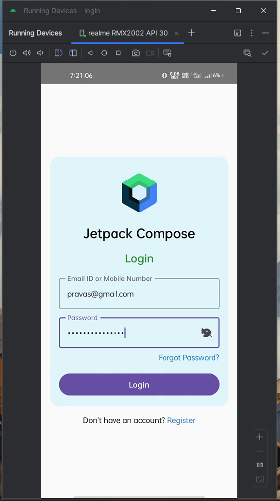
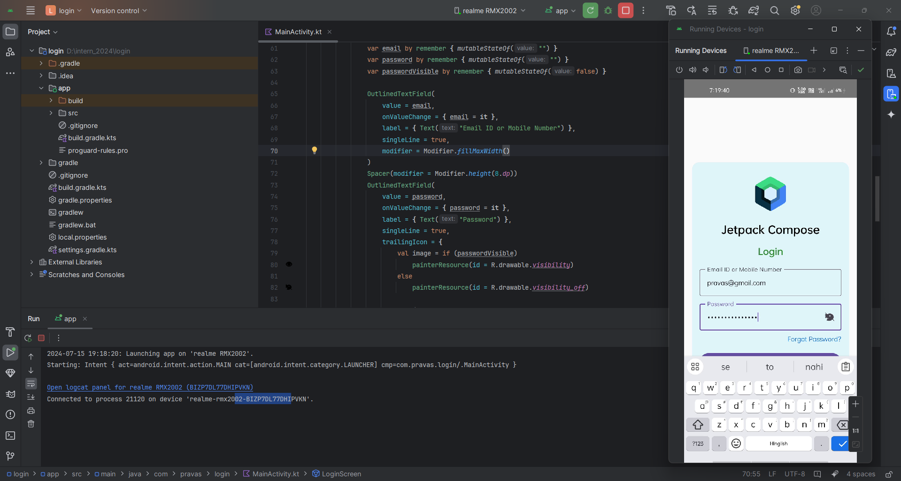

# Login Screen Design

-   Basic Login screen design.
-   Consist of Placeholder for e-mail & password.

## 📷 Screenshots

## How to Run

1. Download/Clone the repository.
2. Open the project in Android Studio.
3. Connect an Android device or start an emulator.
4. Run the application.
